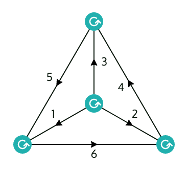
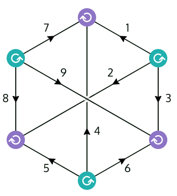

# [`jucys`](https://rufflewind.com/jucys)

`jucys` is a tool for manipulating [angular momentum](https://en.wikipedia.org/wiki/Angular_momentum_operator) diagrams, also known as [Jucys (Yutsis) diagrams](https://en.wikipedia.org/wiki/Angular_momentum_diagrams_(quantum_mechanics)).  You can think of them as a graphical notation for summations over [Wigner 3-jm symbols](https://en.wikipedia.org/wiki/3-j_symbol), much like how Penrose diagrams describe summations over tensors or Feynmann diagrams describe integrals over fields.

<table>
<td><a href="https://rufflewind.com/jucys#%7B%22diagram%22%3A%7B%22nodes%22%3A%5B%7B%22type%22%3A%22w3j%22%2C%22lines%22%3A%5B%2210%22%2C%226%22%2C%221%22%5D%2C%22x%22%3A380%2C%22y%22%3A420%7D%2C%7B%22type%22%3A%22w3j%22%2C%22lines%22%3A%5B%225%22%2C%226%22%2C%2212%22%5D%2C%22x%22%3A520%2C%22y%22%3A180%7D%2C%7B%22type%22%3A%22w3j%22%2C%22lines%22%3A%5B%225%22%2C%229%22%2C%221%22%5D%2C%22x%22%3A660%2C%22y%22%3A420%7D%2C%7B%22type%22%3A%22w3j%22%2C%22lines%22%3A%5B%229%22%2C%2212%22%2C%2210%22%5D%2C%22x%22%3A520%2C%22y%22%3A340%7D%5D%2C%22superlines%22%3A%7B%221%22%3A%7B%22phase%22%3A0%2C%22summed%22%3Afalse%2C%22weight%22%3A0%7D%2C%222%22%3A%7B%22phase%22%3A0%2C%22summed%22%3Afalse%2C%22weight%22%3A0%7D%2C%223%22%3A%7B%22phase%22%3A0%2C%22summed%22%3Afalse%2C%22weight%22%3A0%7D%2C%224%22%3A%7B%22phase%22%3A0%2C%22summed%22%3Afalse%2C%22weight%22%3A0%7D%2C%225%22%3A%7B%22phase%22%3A0%2C%22summed%22%3Afalse%2C%22weight%22%3A0%7D%2C%226%22%3A%7B%22phase%22%3A0%2C%22summed%22%3Afalse%2C%22weight%22%3A0%7D%7D%2C%22lines%22%3A%7B%221%22%3A%7B%22superline%22%3A%226%22%2C%22direction%22%3A1%2C%22arrowPos%22%3A0.5%2C%22arcHeight%22%3A0%2C%22textPos%22%3A0.5%2C%22textOffset%22%3A0%2C%22angle%22%3A1.5707963267948966%7D%2C%225%22%3A%7B%22superline%22%3A%224%22%2C%22direction%22%3A-1%2C%22arrowPos%22%3A0.5%2C%22arcHeight%22%3A0%2C%22textPos%22%3A0.5%2C%22textOffset%22%3A0%2C%22angle%22%3A1.5707963267948966%7D%2C%226%22%3A%7B%22superline%22%3A%225%22%2C%22direction%22%3A-1%2C%22arrowPos%22%3A0.5%2C%22arcHeight%22%3A0%2C%22textPos%22%3A0.5%2C%22textOffset%22%3A0%2C%22angle%22%3A4.71238898038469%7D%2C%229%22%3A%7B%22superline%22%3A%222%22%2C%22direction%22%3A-1%2C%22arrowPos%22%3A0.5%2C%22arcHeight%22%3A0%2C%22textPos%22%3A0.5%2C%22textOffset%22%3A0%2C%22angle%22%3A1.5707963267948966%7D%2C%2210%22%3A%7B%22superline%22%3A%221%22%2C%22direction%22%3A-1%2C%22arrowPos%22%3A0.5%2C%22arcHeight%22%3A0%2C%22textPos%22%3A0.5%2C%22textOffset%22%3A0%2C%22angle%22%3A4.71238898038469%7D%2C%2212%22%3A%7B%22superline%22%3A%223%22%2C%22direction%22%3A-1%2C%22arrowPos%22%3A0.5%2C%22arcHeight%22%3A0%2C%22textPos%22%3A0.5%2C%22textOffset%22%3A0%2C%22angle%22%3A4.71238898038469%7D%7D%2C%22deltas%22%3A%5B%5D%7D%2C%22frozen%22%3Afalse%2C%22showAmbient%22%3Atrue%7D"></a></td>
<td><a href="https://rufflewind.com/jucys#%7B%22diagram%22%3A%7B%22nodes%22%3A%5B%7B%22type%22%3A%22w3j%22%2C%22lines%22%3A%5B%2211%22%2C%2218%22%2C%225%22%5D%2C%22x%22%3A520%2C%22y%22%3A200%7D%2C%7B%22type%22%3A%22w3j%22%2C%22lines%22%3A%5B%225%22%2C%2215%22%2C%2220%22%5D%2C%22x%22%3A660%2C%22y%22%3A280%7D%2C%7B%22type%22%3A%22w3j%22%2C%22lines%22%3A%5B%2219%22%2C%2211%22%2C%2214%22%5D%2C%22x%22%3A520%2C%22y%22%3A520%7D%2C%7B%22type%22%3A%22w3j%22%2C%22lines%22%3A%5B%2216%22%2C%2215%22%2C%2214%22%5D%2C%22x%22%3A380%2C%22y%22%3A440%7D%2C%7B%22type%22%3A%22w3j%22%2C%22lines%22%3A%5B%2217%22%2C%2218%22%2C%2216%22%5D%2C%22x%22%3A380%2C%22y%22%3A280%7D%2C%7B%22type%22%3A%22w3j%22%2C%22lines%22%3A%5B%2219%22%2C%2217%22%2C%2220%22%5D%2C%22x%22%3A660%2C%22y%22%3A440%7D%5D%2C%22superlines%22%3A%7B%221%22%3A%7B%22phase%22%3A0%2C%22summed%22%3Afalse%2C%22weight%22%3A0%7D%2C%222%22%3A%7B%22phase%22%3A0%2C%22summed%22%3Afalse%2C%22weight%22%3A0%7D%2C%223%22%3A%7B%22phase%22%3A0%2C%22summed%22%3Afalse%2C%22weight%22%3A0%7D%2C%224%22%3A%7B%22phase%22%3A0%2C%22summed%22%3Afalse%2C%22weight%22%3A0%7D%2C%225%22%3A%7B%22phase%22%3A0%2C%22summed%22%3Afalse%2C%22weight%22%3A0%7D%2C%226%22%3A%7B%22phase%22%3A0%2C%22summed%22%3Afalse%2C%22weight%22%3A0%7D%2C%227%22%3A%7B%22phase%22%3A0%2C%22summed%22%3Afalse%2C%22weight%22%3A0%7D%2C%228%22%3A%7B%22phase%22%3A0%2C%22summed%22%3Afalse%2C%22weight%22%3A0%7D%2C%229%22%3A%7B%22phase%22%3A0%2C%22summed%22%3Afalse%2C%22weight%22%3A0%7D%7D%2C%22lines%22%3A%7B%225%22%3A%7B%22superline%22%3A%221%22%2C%22direction%22%3A-1%2C%22arrowPos%22%3A0.5%2C%22arcHeight%22%3A0%2C%22textPos%22%3A0.5%2C%22textOffset%22%3A-10%2C%22angle%22%3A1.5707963267948966%7D%2C%2211%22%3A%7B%22superline%22%3A%224%22%2C%22direction%22%3A-1%2C%22arrowPos%22%3A0.7000000000000001%2C%22arcHeight%22%3A0%2C%22textPos%22%3A0.7000000000000001%2C%22textOffset%22%3A-10%2C%22angle%22%3A1.5707963267948966%7D%2C%2214%22%3A%7B%22superline%22%3A%225%22%2C%22direction%22%3A1%2C%22arrowPos%22%3A0.5%2C%22arcHeight%22%3A0%2C%22textPos%22%3A0.5%2C%22textOffset%22%3A0%2C%22angle%22%3A4.71238898038469%7D%2C%2215%22%3A%7B%22superline%22%3A%222%22%2C%22direction%22%3A1%2C%22arrowPos%22%3A0.30000000000000004%2C%22arcHeight%22%3A0%2C%22textPos%22%3A0.30000000000000004%2C%22textOffset%22%3A20%2C%22angle%22%3A2.6224465393432705%7D%2C%2216%22%3A%7B%22superline%22%3A%228%22%2C%22direction%22%3A-1%2C%22arrowPos%22%3A0.5%2C%22arcHeight%22%3A0%2C%22textPos%22%3A0.5%2C%22textOffset%22%3A0%2C%22angle%22%3A-1.5707963267948966%7D%2C%2217%22%3A%7B%22superline%22%3A%229%22%2C%22direction%22%3A1%2C%22arrowPos%22%3A0.30000000000000004%2C%22arcHeight%22%3A0%2C%22textPos%22%3A0.30000000000000004%2C%22textOffset%22%3A-20%2C%22angle%22%3A0.5191461142465229%7D%2C%2218%22%3A%7B%22superline%22%3A%227%22%2C%22direction%22%3A-1%2C%22arrowPos%22%3A0.5%2C%22arcHeight%22%3A0%2C%22textPos%22%3A0.5%2C%22textOffset%22%3A10%2C%22angle%22%3A0.7853981633974483%7D%2C%2219%22%3A%7B%22superline%22%3A%226%22%2C%22direction%22%3A1%2C%22arrowPos%22%3A0.5%2C%22arcHeight%22%3A0%2C%22textPos%22%3A0.5%2C%22textOffset%22%3A20%2C%22angle%22%3A4.71238898038469%7D%2C%2220%22%3A%7B%22superline%22%3A%223%22%2C%22direction%22%3A1%2C%22arrowPos%22%3A0.5%2C%22arcHeight%22%3A0%2C%22textPos%22%3A0.5%2C%22textOffset%22%3A0%2C%22angle%22%3A5.497787143782137%7D%7D%2C%22deltas%22%3A%5B%5D%7D%2C%22frozen%22%3Afalse%2C%22showAmbient%22%3Atrue%7D"></a></td>
</tr>
<tr>
<td colspan="2" align="center"></td>
</tr>
<tr>
</table>

The essential features of the tool have been implemented, but it’s not been thoroughly tested.  The user interface is rather clunky and the source code quite messy and incoherent.

The implementation here isn’t completely faithful to Jucys’ original presentation.  In particular, arrows are *not* interpreted as variances, but simply as phase factors.  Fortunately, the net effect of this change is quite minor and translation to and from conventional Jucys diagrams is nearly trivial.  See § Interpretation.

## Running the tool

You can try it out here: <https://rufflewind.com/jucys>

It’s a client-side web application written in JavaScript that runs entirely in your own browser.  You don’t even need a server to run it!

The implementation makes extensive use of [ES2016](https://en.wikipedia.org/wiki/ECMAScript#7th_Edition_-_ECMAScript_2016) and SVG, so you’ll need a pretty modern browser to run it.  It has been tested on Chromium and Firefox.  It may or may not work on Safari or Edge, and most likely won’t work on IE.  There’s no support for mobile platforms, sorry.  You’ll need a working mouse with a scroll-wheel button (middle button).

If you want to run it on your own computer or web server, you’ll have to build the source code by running `make`.  You’ll need:

  - Some flavor of [Make](https://en.wikipedia.org/wiki/Make_(software))
  - [npm](https://npmjs.com)
  - [Bower](https://bower.io)
  - [Pandoc](https://pandoc.org)
  - [PureScript](http://purescript.org)
  - [Pulp](https://github.com/purescript-contrib/pulp)

as well as all the dependencies listed in `package.json` and `tools/bower.json`, which are installed using `npm` and `bower` respectively.  The output is written to the `dist` directory.

## Usage

### Input

There are two ways to create a diagram: you can either draw it manually using the diagram editor, or specify them as text using the *diagram input tool* (<https://rufflewind.com/jucys/tools>).  The input tool is faster, but more limited in what it can do.

The syntax of the input tool is as follows:

  - Every line of input corresponds to a collection of angular momenta that sums to *zero*.  In other words, it means every line of input corresponds to either a spherical tensor matrix element coupled using the Wigner–Eckart theorem, or an overlap between two angular momentum states.
  - Clebsch–Gordan coupling is written using plus and minus signs just like in kindergarten.
  - Variables that are the same up to primes/apostrophes are implicitly summed over (only the <code><var>m</var></code>s, not <code><var>j</var></code>s).
  - Comments are prefixed by `#` like in Python or Bash.

Note that diagrams created by the input tool always start off in the *reduction mode* of the editor, which means you can do algebraic manipulations that preserve equivalence, but if you want to break equivalence you have to exit that mode.  See the documentation on the editor for more information.

#### Example 1: Recoupling coefficient for (12)3 ↔ 1(23)

For example, say you want to look at the textbook example of the recoupling coefficient:

    ⟨ (a b) c | a (b c) ⟩

This translates to the following input:

    rec ((a + b) + c) (a + (b + c))

Type that in and click the “Show diagram” button.  After a little bit of manipulation you’ll see it corresponds to a 6-j symbol (a.k.a. tetrahedral graph/K4/W4) up to phases and weights.

Note that the input editor does *not* specify which <code><var>j</var></code>s to sum over.  It can’t, because it has no clue which is the source coupling and which is the destination coupling you want.  In any case, it’s easy to tell what needs to be summed over, because those are always the <code><var>j</var></code>s that don’t show up on the other side of the equation!

The plus signs are important: they indicate that the angular momenta are covariant with respect to each other.  If you want to couple a normal angular momentum with a *time-reversed* angular momentum, then you have to write `a - b` instead.  “Negation” as far as the input tool is concerned just means the insertion of a metric tensor <code>(−1)<var>j</var> − <var>m</var> δ<var>m</var>, −<var>m</var>′</code>.  Negating twice doesn’t give you the exact same angular momentum back; instead it accumulates a phase of <code>(−1)2 <var>j</var></code>.  The ordering is important too: `a + b` and `b + a` aren’t quite the same: they are different up to a phase factor.

What `rec` does is actually pretty dumb: it just connects the total angular momenta of both sides together, and then divides by <code>(2 <var>j</var>total + 1)</code>.

#### Example 2: Pandya transform (12)k(34) ↔ (14)k(32)

Reduced matrix elements of spherical tensors is written using `wet`.  Here, the Wigner–Eckart coupling convention of Wigner, Racah, and many others is used:

<pre><code>⟨<var>j</var>a <var>m</var>a|<var>T</var><var>k</var><var>q</var>|<var>j</var>b <var>m</var>b⟩ = (−1)<var>j</var>a − <var>m</var>a (<var>j</var>a <var>m</var>a <var>k</var> <var>q</var> <var>j</var>b <var>m</var>b) ⟨<var>j</var>a‖<var>T</var><var>k</var>‖<var>j</var>b⟩</code></pre>

For example, say you want to derive the transformation between ordinary two-body matrix elements and Pandya matrix elements:

    ⟨ a b ‖ k ‖ c d ⟩ ↔ ⟨ a −d ‖ k ‖ c −b ⟩

Here, `k` denotes the spherical tensor rank and the minus sign indicates time-reversal.  To input this, you write each matrix element on its own line, coupled with `wet`:

    wet (a + b) k (c + d)
    wet (a - d) k (c - b)

The ordering of lines doesn’t matter, because recoupling coefficients are real and symmetric!  You’ll see right away that this is a 9-j symbol (a.k.a. utility graph/Thomsen graph/K3,3).

If you want to look at just scalar coupling, then you just need to replace `k` with `0` (either in the diagram input or diagram editor).  After a bit of manipulation, you’ll get essentially a 6-j symbol up to Kronecker deltas, phases, and weights.

#### Example 3: A tensor product

Without motivating why we care about tensor products, suppose you want to calculate the Clebsch–Gordan coupled product:

    ⟨ p | C | q ⟩ = ∑[i a b] ⟨ A B | C ⟩ ⟨ i p | A | a b ⟩ ⟨ a b | B | i q ⟩

The corresponding input would be

    wet (i+p) A (a+b)
    wet (a+b) B (i+q)
    wet p (A+B) q

After some simplifications, you should get two 6-j symbols, plus a triangular delta.

### Layout

The interface of the tool is divided into four parts:

  - There’s the header at the very top, which doesn’t really do much – most of the “buttons” aren’t even clickable.
  - The main frame in the middle shows the diagram, the raison d’être of this tool.  This will be explained later.
  - The right sidebar shows the <i>tableau</i>, which tracks the boring details like phases, weights, and Kronecker deltas.  This will also be explained later.
  - The footer at the bottom, if clicked, will render the equation.  It doesn’t automatically update unless you click it because MathJax is slooow.  Moreover, it quickly outgrows its usefulness because it doesn’t have the ability to recognize any of the 3<var>n</var>-j symbols, so you end with monstrous summations over 3-jm symbols instead.

### Modes

The tool distinguishes between two major modes:

- **Editing mode**: In this mode, the tool makes no attempt to stop you from doing nasty things that violate equivalence.  This is where you create/delete nodes, connect/rename lines, adjust the tableau, etc.
- **Reduction (“frozen”) mode**: Once you turn on reduction mode, the tool will only allow actions that preserve equivalence of the diagram.  Some actions also behave differently in this mode.

You can switch between the two modes using the <kbd>f</kbd> key.

### Undo/Redo

This used to be a feature early on, but it was quickly removed because you can already Undo/Redo using the Back/Forward buttons of your browser.  This should work even if, say, the app malfunctions due to a bug.

Every change to the diagram automatically updates the URL, so you can even “save” diagrams by bookmarking the URL.  You can also send it to other people.  (The URL can get really long though!)

### General controls

  - A general rule of thumb is that left-click usually does something fairly harmless (e.g. moving things around).
  - Right-click and middle-click are used to perform modifications on various parts of the diagram (especially reductions).  Right and middle buttons are also used for dragging, with meaning that’s dependent on context.
  - Pressing Ctrl while moving an object snaps the object to a grid.

The remaining key and mouse bindings are specified in the following sections on Editing mode and Reduction mode.

### Editing mode

- <kbd>w</kbd>: Create a Wigner 3-jm symbol at the location of your cursor.
- <kbd>c</kbd>: Create a Clebsch-Gordan coefficient at the location of your cursor.
- <kbd>a</kbd>: Attach/join two nearby terminals, forming a single line.
- <kbd>x</kbd>: Delete a node or a free line (can be indirectly used to detach lines).
- <kbd>v</kbd>: Toggle the visibility of ambient arrows (see § Orientable diagrams).
- <kbd>f</kbd>: Switch between editing mode and reduction (frozen) mode.
- <kbd>s</kbd>: Save the diagram as an SVG image.
- <kbd>r</kbd>: Reset and clear the entire diagram (if you encounter a bug in the app and <kbd>r</kbd> doesn’t work, you can still click on this button to reset).
- <kbd>Right-click</kbd> on a line to add/flip/remove the arrow.  Unlike in reduction mode, this does not alter the phase at all.
- <kbd>Middle-click</kbd> on a line to change its <code><var>j</var></code> to a fresh value.

The tableau is editable too: you can left/middle/right click on things, drag phases and weights around, etc.  Some of these modifications are still available (albeit more restricted) while frozen.

### Reduction (“frozen”) mode

Rules preserve the meaning of the diagram.

Other than the explicit rules listed here, you’re always allowed to move things around freely (except terminals).  You can <kbd>Left-drag</kbd> nodes, lines, arrows, and labels.

#### Minor rules

- **Arrow flip**: <kbd>Right-click</kbd> on a line to flip the arrow.  This changes the phase by <code>(−1)2 <var>j</var></code>.  On <code><var>j</var> = 0</code> lines, this can also conjure arrows out of thin air.

- **Triple arrow rule**: <kbd>Right-click</kbd> on a 3-jm node to alter the surrounding arrows.

- **Orientation flip:** <kbd>Middle-click</kbd> on a 3-jm node to flip its orientation.  This changes phase by <code>(−1)<var>j</var>1 + <var>j</var>2 + <var>j</var>3</code>.

- **Triple phase rule**: <kbd>Shift</kbd> + <kbd>Middle-click</kbd> on a node to
  change the phase by <code>(−1)2 <var>j</var>1 + 2 <var>j</var>2 + 2 <var>j</var>3</code>.

- **Variable exchange**: <kbd>Middle-click</kbd> on a line cycles through the <code><var>j</var></code> variables that are known to be equal due to Kronecker deltas.  If the line is a loop, this will instead create swap to a fresh, unused variable, which you can then rename to whatever you want.

- **Variable renaming**: You can rename bound variables as long as it doesn’t conflict with an existing variable.

- **Summation elimination**: <kbd>Right-click</kbd> on a summation sign in the tableau to eliminate this variable if it’s constrained by a Kronecker delta.

- **Delta modification**: You can add/remove Kronecker deltas as long as the parts that are lost/gained are still inferrable from the diagram itself.

- **Delta transport**: Phases and weights can be “transported” along a Kronecker delta by drag and drop.

#### Major rules

- **(I) Identity introduction (pinching rule):** <kbd>Right-drag</kbd> a line onto another line will introduce a resolution of the identity as two 3-jm nodes, with a summation over <code><var>j</var></code> in between.

- **(I′) Identity elimination (prying rule):** <kbd>Middle-drag</kbd> a summed line onto itself to eliminate a resolution of the identity, destroying two 3-jm nodes.

- **(II) Loop elimination (pruning rule):** <kbd>Right-drag</kbd> a loop line onto its neighboring node will the set the opposite line to zero, and try to erase the loop entirely along with the two adjacent 3-jm nodes.

- **(II′) Loop introduction (growing rule):** <kbd>Middle-drag</kbd> a line onto empty space will create two 3-jm nodes along with a loop (dual of pruning rule).

- **(III) Zero elimination (cutting rule):** <kbd>Right-drag</kbd> a line onto itself will split the diagram into two separate pieces, creating two 3-jm nodes in the process.  This only works if at least one of the subdiagrams is orientable (see § Orientable diagrams).

- **(III′) Zero introduction (gluing rule):** <kbd>Middle-drag</kbd> a line onto another line will join the two lines together, creating two 3-jm nodes in the process.

## Tableau

The tableau consists of two parts:

  - The upper table:
      - Leftmost column: whether the <code><var>j</var></code> is being summed over.
      - 2nd column: label of the <code><var>j</var></code>
      - 3rd column: phase; each dot stands for a single <code>(−1)<var>j</var></code> phase
      - Rightmost column: <code>√(2 <var>j</var> + 1)</code> weights (only the exponent is shown)
  - The lower list shows the Kronecker deltas.

### Orientable diagrams

A diagram is <b>fully oriented</b> if every internal line has an arrow.  A diagram is <b>orientable</b> if there exists an equivalent diagram that is fully oriented.

Some rules (e.g. pinching rule) can introduce cycles into the diagram if used carelessly.  Diagrams without cycles are always orientable, but those with cycles can become non-orientable if the number of arrows and the number of lines in a cycle differ in [parity](https://en.wikipedia.org/wiki/Parity_(mathematics)).  This is bad, because then you can’t use the cutting rule anymore.  Hence, it is advisible to keep the diagram fully oriented at every stage of the manipulation.

You can also observe whether the diagram is orientable by enabling ambient arrows via <kbd>v</kbd>.  Ambient arrows are translucent arrows that the editor automatically inserts using the three arrow rule.  If the editor fails to find an orientable diagram, it will display the discrepancies in red: a red arrow means that the arrow shouldn’t be there, and a red circle means there should’ve been an arrow there.  Take note that the editor only tries to find *one fully oriented diagram* – there’s almost always multiple possible fully oriented diagrams!

## Interpretation

Currently, the tool supports two kinds of nodes.  The **3-jm nodes** represent Wigner 3-jm symbols.  The arguments are determined by the lines connected to it, read in the order dictated by the circular arrow.

<pre><code>
          <var>j</var>3 <var>m</var>3
            |
            |
            |
------------↺------------
<var>j</var>1 <var>m</var>1                <var>j</var>2 <var>m</var>2

= (<var>j</var>1 <var>j</var>2 <var>j</var>3)
  (<var>m</var>1 <var>m</var>2 <var>m</var>3)
</code></pre>

(This differs superficially from conventional Jucys diagrams where the orientation is annotated using plus or minus signs.)

**Terminals**, which are the dangling ends of lines.  Every terminal is associated with an *external* <code>(<var>j</var>, <var>m</var>)</code> pair that isn’t being summed over.

Each **line** represents a <code>(<var>j</var>, <var>m</var>)</code> pair.  For internal lines (not connected to any terminal), the <code><var>m</var></code> is summed over, whereas this is not true for external lines (connected to at least one terminal).  On certain lines, the <code><var>j</var></code> is summed over as well – this is indicated by <code>∑</code> in the tableau.

The label of a line describes the label of the <code><var>j</var></code>, not the <code><var>m</var></code>.  Every line represents a unique <code><var>m</var></code> variable, so it’s unnecessary to show the <code><var>m</var></code> variables.

An arrow represents a phase as well as a reversal in the sign of the

<pre><code>
      <var>j</var>
<var>m</var> ---->---- <var>m</var>′

= (−1)<var>j</var> − <var>m</var> δ<var>m</var>, −<var>m</var>′</code></pre>

This is the so-called *metric tensor* in angular momentum theory.  This is the main difference from the conventional Jucys diagrams, which instead use arrows for variance (bra vs ket / time-forward vs time-reversed).

Translating from conventional Jucys diagrams to the formalism here is pretty straightforward.  Simply erase all outgoing arrows on external lines.

To translate back, first use the standard rules to convert the diagram into a fully oriented form and adjust the arrows on external lines so that they always point inward (be sure to account for the change in phases if needed).  Then, on the remaining lines that have no arrows at all, simply draw arrows pointing outward.  Obviously, this means non-orientable diagrams cannot be written using conventional Jucys diagrams.

## Bugs

Please [file a bug report](https://github.com/Rufflewind/jucys/issues) if you run into any of the following:

- JavaScript error, causing the app to stop responding
- An action violates equivalence in reduction mode

Be sure to include the problematic diagram (include the URL!) as well as any logs from your browser’s developer console.

Keep in mind that even if something breaks, you can still hit the Back button of your browser to revert to a previous state.
